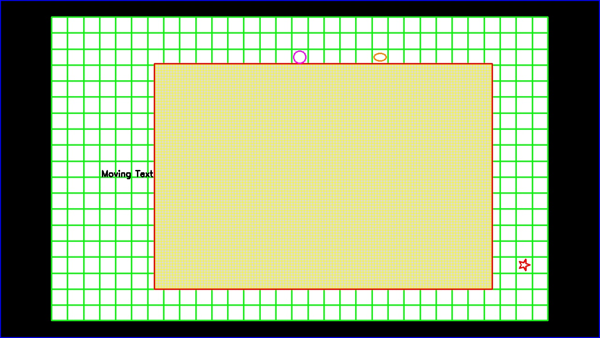

# Использование примитивов рисования, текста и анимации в OpenCV

Программа демонстрирует следующие возможности библиотеки OpenCV на C++:
- рисование графических примитивов (линия, прямоугольник, окружность, эллипс, произвольный многоугольник)
- вывод текста на изображение
- анимация
- отображение результата в окне
- сохранение итогового изображения на диск

## Запуск программы

1. Убедитесь, что в папке с исполняемым файлом (или в системном PATH) присутствуют следующие DLL-файлы OpenCV:
   - `opencv_world480.dll`
   - `opencv_world480d.dll` (для отладочной сборки)
2. Запустите `main.exe`.
3. Откроется окно с отображением нарисованных фигур и анимированным текстом.
4. **Закройте окно** (нажатием `×` или клавиши `Esc`) - программа завершит работу и сохранит итоговое изображение **в папку с исполняемым файлом** под именем `result.jpg`.

## Параметры конфигурации

В коде программы можно настроить следующие параметры:

| Параметр | Описание | Значение по умолчанию |
|----------|----------|----------------------|
| `a`, `b` | Количество ячеек основной сетки (ширина, высота) | 31 × 19 |
| `alpha`, `beta` | Количество ячеек вложенной сетки (ширина, высота) | 120 × 80 |
| `r_a`, `r_b` | Соотношение сторон ячеек основной сетки | 1:1 |
| `r_alpha`, `r_beta` | Соотношение сторон ячеек вложенной сетки | 1:1 |
| `w`, `h` | Размер окна в пикселях | 1280 × 720 |
| `m`, `n` | Максимальное количество ячеек основной сетки для вложенной | 24 × 14 |
| `start_cell_x`, `start_cell_y` | Начальная позиция вложенной сетки внутри основной (вложенная сетка центрируется в указанной области, поэтому не всегда будет начинаться из этой координаты) | (5, 3) |
| `star_cell_x`, `star_cell_y` | Позиция звезды | (29, 15) |
| `circle_cell_x`, `circle_cell_y` | Позиция круга | (15, 2) |
| `ellipse_cell_x`, `ellipse_cell_y` | Позиция эллипса | (20, 2) |
| `text_cell_x`, `text_cell_y` | Позиция анимированного текста | (3, 10) |

## Используемые функции OpenCV

| Функция | Назначение |
|---------|------------|
| `line()` | Рисование линии |
| `rectangle()` | Рисование прямоугольника |
| `circle()` | Рисование окружности |
| `ellipse()` | Рисование эллипса |
| `polylines()` / `fillPoly()` | Рисование произвольного многоугольника |
| `putText()` | Вывод текстовой подписи |
| `imshow()` | Отображение результата в окне |
| `imwrite()` | Сохранение изображения на диск |
| `waitKey()` | Управление анимацией и задержкой кадров |

## Результат работы

